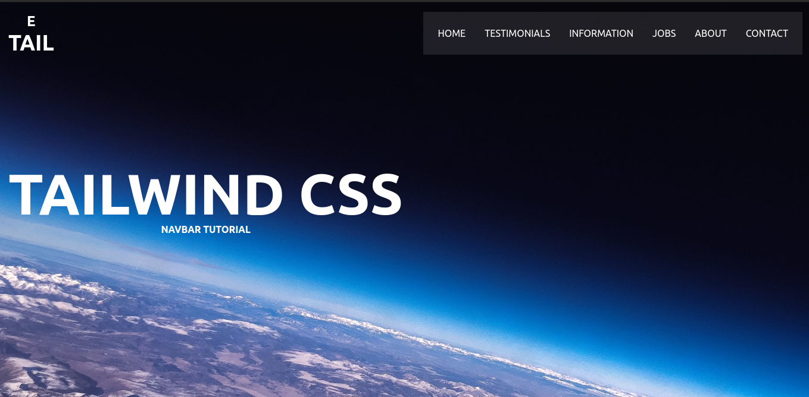

# Responsive Navbar with Tailwind CSS 👨‍💻👨‍💻👨‍💻

> # Description / Descrição

A responsive navbar component made with [Tailwind CSS](https://tailwindcss.com/). This page was built following the [e-side](https://github.com/elnfar/nav-tail-yt) template

[🔗 Click here to access / Clique aqui para acessar](https://vitorfnery.github.io/tailwind-navbar)

## 🛠️ Technologies / Tecnologias

- React
- Tailwind CSS
- Git and Github

## 📣 Contact / Contato

vitorfelipenery@gmail.com
